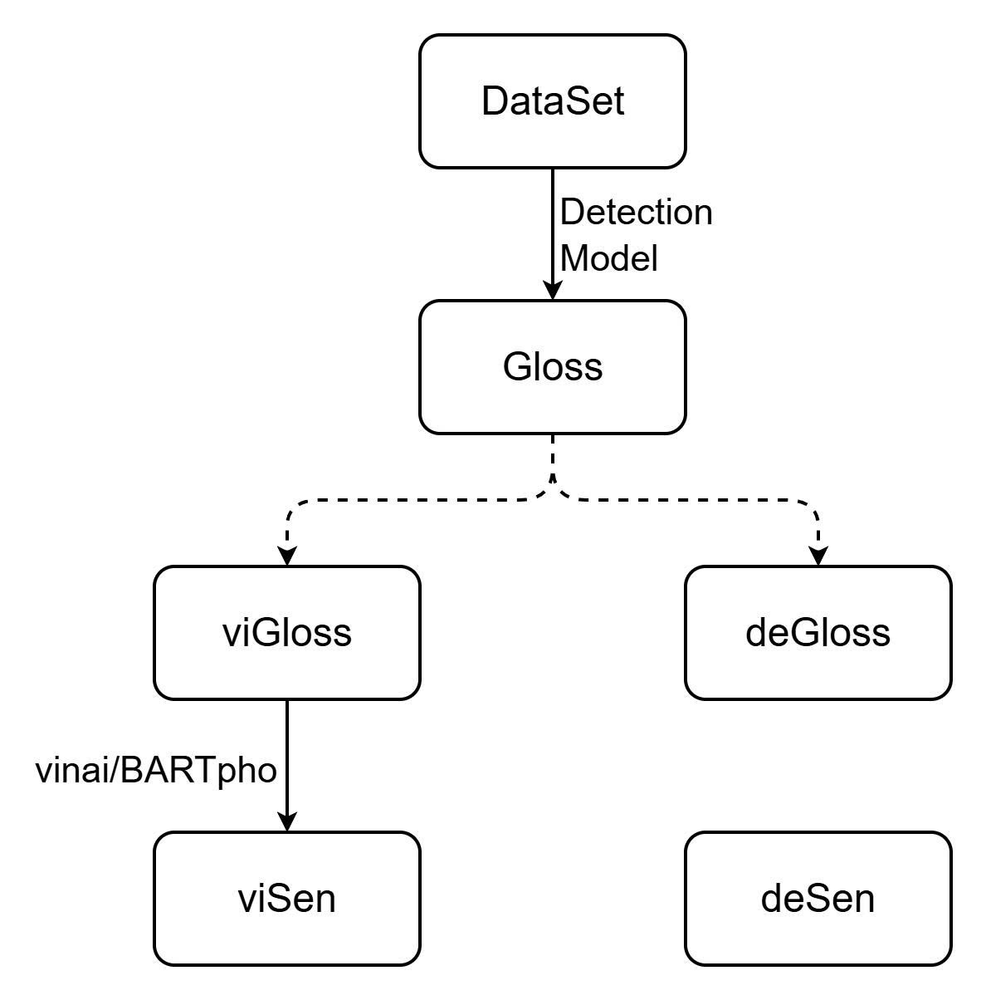
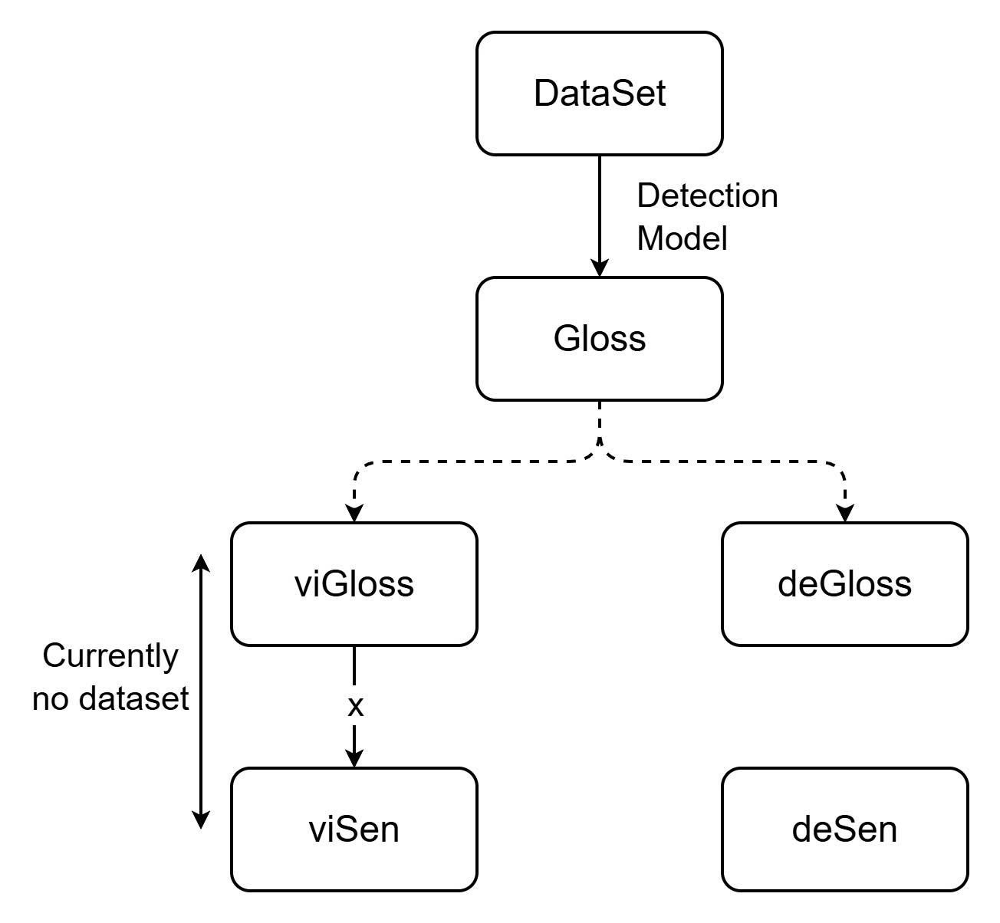
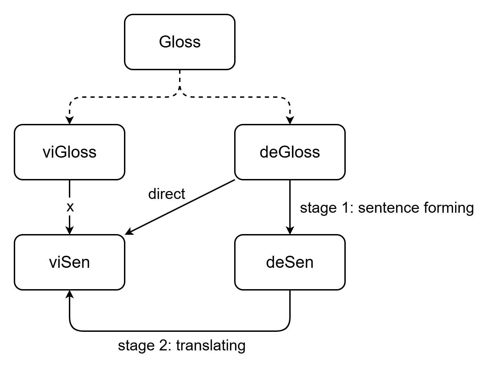
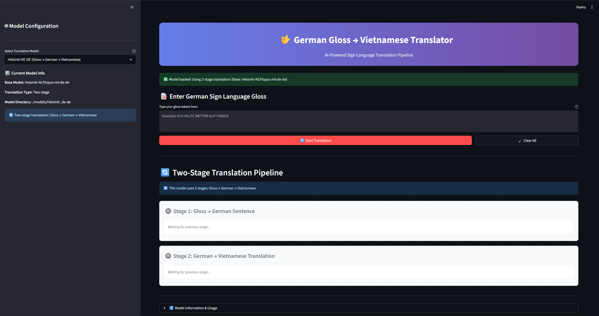

# VSL Gloss-to-Text Translation Project

A comprehensive research project investigating optimal approaches for converting Vietnamese Sign Language (VSL) glosses to Vietnamese text using machine learning models and translation techniques.

## Problem Statement

This project addresses the challenge of translating Vietnamese Sign Language (VSL) glosses to Vietnamese text. Due to the lack of existing Vietnamese gloss-to-text paired datasets, we implement a novel workaround using German sign language data from the RWTH-PHOENIX-Weather 2014 T dataset.

### Ideal vs. Current Approach

**Ideal Solution:** The optimal approach would involve direct translation from VSL glosses to Vietnamese text using a sequence-to-sequence model like [vinai/bartpho-word](https://huggingface.co/vinai/bartpho-word).

<div align="center">

<p><em>Figure 1: Ideal solution - Direct Gloss → Vietnamese Text translation</em></p>
</div>

**Current Challenge:** No existing Vietnamese gloss-to-text paired datasets are available, making the direct approach infeasible.

<div align="center">

<p><em>Figure 2: Current pipeline - Video → Gloss → Text translation</em></p>
</div>

**Proposed Workaround:** Utilize the [RWTH-PHOENIX-Weather 2014 T](https://www-i6.informatik.rwth-aachen.de/~koller/RWTH-PHOENIX-2014-T/) dataset containing German sign language videos, glosses, and corresponding German text.

<div align="center">

<p><em>Figure 3: Workaround solution using German gloss dataset</em></p>
</div>

## Experimental Approaches

We evaluate two translation strategies:

1. **Direct Translation:** German gloss → Vietnamese text
2. **Two-Step Translation:** German gloss → German text → Vietnamese text

## Model Selection

The following pre-trained models are fine-tuned for this task:

- **[vinai/bartpho-word](https://huggingface.co/vinai/bartpho-word):** BART model pre-trained on Vietnamese text
  - Task: German gloss → Vietnamese sentence

- **[Shahm/bart-german](https://huggingface.co/Shahm/bart-german):** BART model pre-trained on German text
  - Task: German gloss → German sentence

- **[Helsinki-NLP/opus-mt-de-de](https://huggingface.co/Helsinki-NLP/opus-mt-de-de):** MarianMT model for German language tasks
  - Task: German gloss → German sentence

- **[Helsinki-NLP/opus-mt-de-vi](https://huggingface.co/Helsinki-NLP/opus-mt-de-vi):** MarianMT model for German-to-Vietnamese translation
  - Task: German sentence → Vietnamese sentence

- **[facebook/mbart-large-50-many-to-many-mmt](https://huggingface.co/facebook/mbart-large-50-many-to-many-mmt):** mBART model supporting 50 languages
  - Tasks: German gloss → Vietnamese sentence, German gloss → German sentence

## Dataset

**Source:** [RWTH-PHOENIX-Weather 2014 T](https://www-i6.informatik.rwth-aachen.de/~koller/RWTH-PHOENIX-2014-T/)

**Processing Pipeline:**
1. Extract gloss and German sentence pairs from the original dataset
2. Clean and preprocess both gloss sequences and German sentences
3. Translate German sentences to Vietnamese using Google Translate
4. Create triplet dataset: `(gloss | German sentence | Vietnamese sentence)`

**Dataset Statistics:**

| Split | Sample Count |
|-------|--------------|
| Train | 7,063        |
| Dev   | 519          |
| Test  | 642          |

## Training Configuration

All models were fine-tuned using consistent hyperparameters:

| Parameter | Value |
|-----------|-------|
| **Sequence Parameters** | |
| Max Input Length | 128 |
| Max Output Length | 128 |
| **Training Parameters** | |
| Epochs | 30 |
| Batch Size | 12 |
| Learning Rate | 5e-4 |
| Weight Decay | 0.01 |
| Warmup Ratio | 0.1 |
| **Optimization** | |
| Optimizer | AdamW |
| LR Scheduler | Cosine |
| Gradient Accumulation Steps | 4 |
| **LoRA Configuration** | |
| Rank (r) | 32 |
| Alpha | 64 |
| Dropout | 0.05 |
| Target Modules | q_proj, v_proj, k_proj, o_proj, fc1, fc2 |

## Evaluation Results

The models were evaluated using standard machine translation metrics on the test set:

| Model | Translation Task | SacreBLEU | CHRF |
|-------|------------------|:-----------:|:------:|
| vinai/bartpho-word | German Gloss → Vietnamese | 23.606 | 38.502 |
| Shahm/bart-german | German Gloss → German | 23.828 | 49.996 |
| Helsinki-NLP/opus-mt-de-de | German Gloss → German | 22.261 | 46.928 |
| Helsinki-NLP/opus-mt-de-vi | German → Vietnamese | 25.601 | 40.762 |
| facebook/mbart-large-50-many-to-many-mmt | German Gloss → German | 24.724 | 50.921 |
| facebook/mbart-large-50-many-to-many-mmt | German Gloss → Vietnamese | 14.417 | 29.545 |

## Getting Started

### Prerequisites

- Python 3.8 or higher
- pip package manager
- CUDA-compatible GPU (recommended for training)

### Installation

1. **Clone the repository:**
   ```bash
   git clone <repository-url>
   cd VSL-Gloss-to-Text
   ```

2. **Install dependencies:**
   ```bash
   pip install -r requirements.txt
   ```

### Running the Demo Application

1. **Start the Streamlit app:**
   ```bash
   streamlit run streamlit_app.py
   ```

2. **Open your browser** and navigate to: `http://localhost:8501`

### Using the Application

1. **Enter German Gloss**: Input German sign language gloss tokens separated by spaces
   - Example: `ICH HEUTE WETTER GUT FINDEN`

2. **Click Translate**: The app processes your input through three stages:
   - **Stage 1**: Clean and process the gloss input
   - **Stage 2**: Convert gloss to German sentence using the fine-tuned model
   - **Stage 3**: Translate German sentence to Vietnamese using Google Translate

3. **View Results**: See both intermediate results and the final Vietnamese translation

### Application Demo

<div align="center">

<p><em>The Streamlit web interface showing the translation process from German gloss to Vietnamese text</em></p>
</div>

## Project Structure

```
VSL-Gloss-to-Text/
├── streamlit_app.py              # Streamlit web application
├── model_utils.py                # Model loading and inference utilities
├── model_config.json             # Model configuration settings
├── requirements.txt              # Python dependencies
├── README.md                     # This file
├── .gitignore                    # Git ignore rules
├── assets/                       # Images and figures for documentation
│   ├── 1_optimal.jpg
│   ├── 2_reality.jpg
│   └── 3_walkaround.jpg
├── data/                         # Processed dataset files
│   ├── PHOENIX-2014-T.train.csv
│   ├── PHOENIX-2014-T.dev.csv
│   ├── PHOENIX-2014-T.test.csv
│   └── *.jsonl                   # JSONL format datasets
├── models/                       # Fine-tuned model checkpoints
│   ├── facebook_de-de/           # Facebook model for German
│   ├── facebook_de-vi/           # Facebook model for German-Vietnamese
│   ├── Helsinki_de-de/           # Helsinki model for German
│   ├── Helsinki_de-vi/           # Helsinki model for German-Vietnamese
│   ├── Shahm/                    # BART German model
│   └── vinai/                    # Vietnamese BART model
└── notebooks/                    # Jupyter notebooks for development
    ├── extract.ipynb             # Data extraction and preprocessing
    └── vsl-finetune.ipynb        # Model fine-tuning experiments
```

## Model Training

The fine-tuned models are stored in the `models/` directory. Each model folder contains:

- `adapter_config.json`: LoRA adapter configuration
- `adapter_model.safetensors`: Fine-tuned model weights
- `tokenizer_config.json`: Tokenizer configuration
- `training_history.json`: Training metrics and history
- Additional tokenizer files (vocabulary, special tokens, etc.)

## Research Notebooks

- **`notebooks/extract.ipynb`**: Data extraction and preprocessing pipeline
- **`notebooks/vsl-finetune.ipynb`**: Model fine-tuning experiments and evaluation

## Contributing

1. Fork the repository
2. Create a feature branch (`git checkout -b feature/amazing-feature`)
3. Commit your changes (`git commit -m 'Add some amazing feature'`)
4. Push to the branch (`git push origin feature/amazing-feature`)
5. Open a Pull Request

## License

This project is licensed under the MIT License - see the LICENSE file for details.

## Acknowledgments

- [RWTH-PHOENIX-Weather 2014 T](https://www-i6.informatik.rwth-aachen.de/~koller/RWTH-PHOENIX-2014-T/) dataset
- Hugging Face for providing pre-trained models
- The research community for advancing sign language translation

## Contact

For questions or collaboration opportunities, please open an issue or contact the project maintainers.

---

*This project represents ongoing research in sign language translation and machine learning. Results and methodologies are documented for reproducibility and further research.*